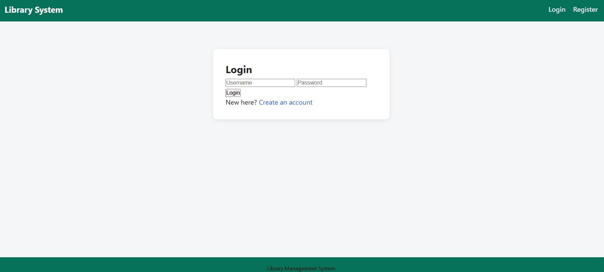
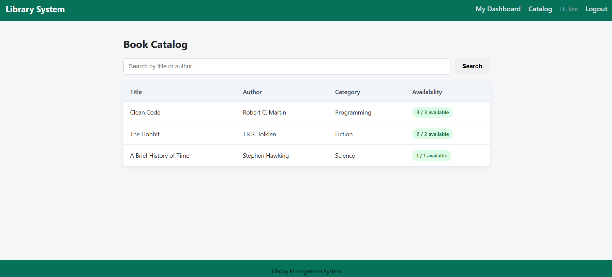
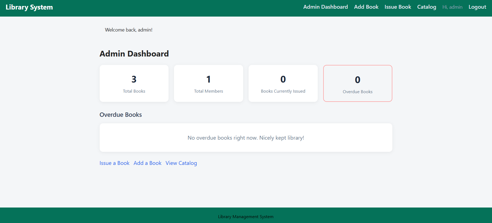
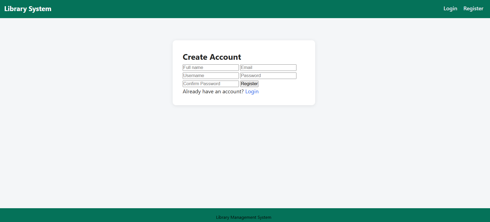

# Library Management System

A one-week capstone project: a real-time web application built with Python, Flask, HTML, and CSS.

## Problem Statement

Schools and colleges often manage library books using notebooks or spreadsheets, making it hard to search for books, track due dates, and calculate late fines. This project replaces that manual process with a small web application that an admin can use to manage the library, and that members can use to browse, borrow, and track their own books.

## Features

- **Authentication** — member registration, login/logout, and a separate admin login, using Flask sessions
- **Role-based access control** — admin-only pages are protected; members only see their own data
- **Book Catalog** — browse all books with search by title or author
- **Book Management (Admin)** — add, edit, and delete books from the catalog
- **Issue Book (Admin)** — issue a book to a member with an automatic 14-day due date
- **Return Book (Admin)** — mark a book as returned, with automatic fine calculation for late returns
- **Member Dashboard** — view currently borrowed books, due dates, and total fine owed
- **Admin Dashboard** — summary view of total books, total members, books issued, and overdue count
- **Flash messages** — feedback shown for every action (login, registration, add/edit/delete, issue/return)
- **Consistent design** — one shared base template and one shared CSS file across all pages

## Tech Stack

| Layer | Technology |
|---|---|
| Backend | Python 3, Flask |
| Templating | Jinja2 |
| Frontend | HTML5, CSS3 |
| Data Storage | In-memory Python lists/dictionaries (no database) |

## Project Structure

```
library_system/
├── app.py                      # All Flask routes and application logic
├── templates/
│   ├── base.html                 # Shared layout (navbar, footer, flash messages)
│   ├── login.html
│   ├── register.html
│   ├── catalog.html
│   ├── dashboard.html            # Member dashboard
│   ├── admin_dashboard.html
│   ├── admin_add_book.html
│   ├── admin_edit_book.html
│   └── admin_issue.html
├── static/
│   └── style.css                 # Shared stylesheet
└── README.md
```

## How to Run

1. Make sure Python 3 is installed.
2. (Recommended) Create and activate a virtual environment:
   ```bash
   python -m venv venv
   source venv/bin/activate      # On Windows: venv\Scripts\activate
   ```
3. Install Flask:
   ```bash
   pip install flask
   ```
4. Run the application:
   ```bash
   python app.py
   ```
5. Open your browser and go to: `http://127.0.0.1:5000/`

## Login Credentials

**Admin**
- Username: `admin`
- Password: `admin123`

**Member**
- Register a new account from the Register page.

## Data Model

- `books` — list of dicts: `id`, `title`, `author`, `category`, `total_copies`, `available_copies`
- `members` — dict keyed by username: `name`, `email`, `password`
- `issued_records` — list of dicts: `record_id`, `book_id`, `username`, `issue_date`, `due_date`, `return_date`, `fine`

## Notes

- Data is stored in memory using Python data structures and resets whenever the server restarts. This is expected, since no database is used.
- Fine rate and loan period can be adjusted in `app.py` via the `FINE_PER_DAY` and `LOAN_PERIOD_DAYS` constants.

## Route Map

| Route | Method(s) | Purpose |
|---|---|---|
| `/` | GET | Redirects to login or dashboard based on session |
| `/register` | GET, POST | Member registration |
| `/login` | GET, POST | Member and admin login |
| `/logout` | GET | Clears session, redirects to login |
| `/catalog` | GET | Browse/search all books |
| `/dashboard` | GET | Member dashboard |
| `/admin/dashboard` | GET | Admin summary view |
| `/admin/books/add` | GET, POST | Add a new book |
| `/admin/books/edit/<int:book_id>` | GET, POST | Edit an existing book |
| `/admin/books/delete/<int:book_id>` | GET | Remove a book |
| `/admin/issue` | GET, POST | Issue a book to a member |
| `/admin/return/<int:record_id>` | GET | Mark a book as returned, compute fine |


## Screenshots

### Login Page


### Book Catalog


### Admin Dashboard


### Member Dashboard

